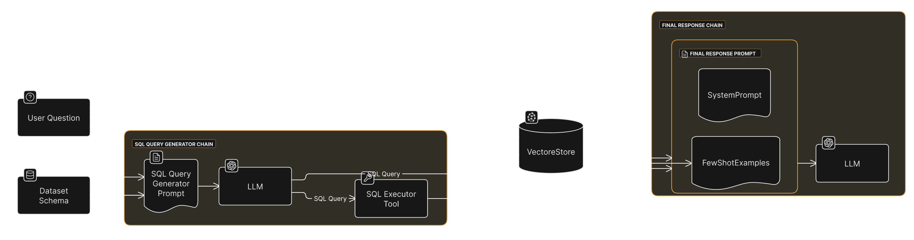
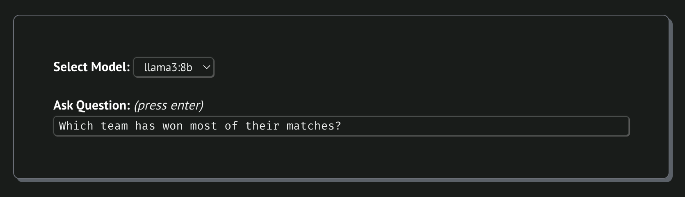
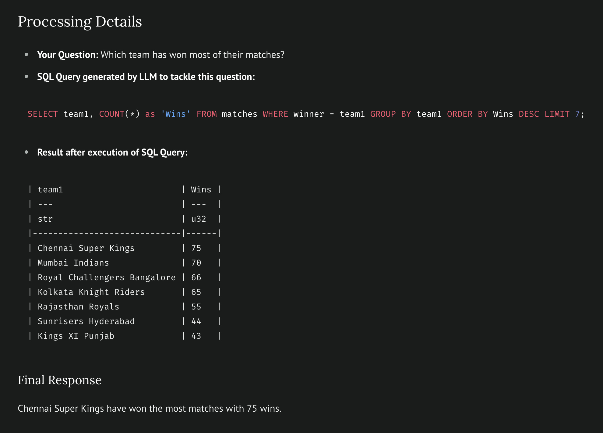

# Chat with IPL Dataset

As I am learning some applications of LLMs, I am also trying to built a **Chat With Data** application with LangChain
and LangGraph like tools using LLM.

[**👀 See the best script**](#_3_few_shot_chatpy)

> \[!IMPORTANT\]
>
> 1. Using [`uv`](https://github.com/astral-sh/uv) to run the scripts.
> 2. Below scripts uses `ollama` to interact with LLMs (`llama3:8b`/`mistral:7b`). So you need to install
>    [`ollama`](https://github.com/ollama/ollama) in you system.

## `_1_query_pandas_df.py`

Query your pandas dataframe using LLM.

### Usage

```bash
uv run _1_query_pandas_df.py
```

### Approach

- Used IPL dataset from Kaggle. (https://kaggle.com/datasets/patrickb1912/ipl-complete-dataset-20082020)
- Used Ollama to interact with LLMs.
- Used `PythonAstREPLTool` to execute generated pandas code.
- The resultant answer then passes to another LLM to form a better response for user.

## `_2_sql_react_agent.py`

Query csv file using SQL statements.

### Usage

```bash
uv run _2_sql_react_agent.py \
  "How many matches played by CSK?" \
  "How many they won out of them?" \
```

### Approach

- Used IPL dataset from kaggle. (https://kaggle.com/datasets/patrickb1912/ipl-complete-dataset-20082020)
- Polars library to query a `pl.LazyFrame` object with SQL statements using `pl.SQLContext` object.
  - See docs: https://docs.pola.rs/user-guide/sql/intro
- Used [`create_react_agent`](https://langchain-ai.github.io/langgraph/reference/prebuilt/) from LangGraph library for
  this task.
- Tried to implement memory feature.

## `_3_few_shot_chat.py`

### Approach



<details>
<summary>✏️ Diagram Code</summary>

```
direction right
styleMode plain
typeface clean

User Question [icon: question]
Dataset Schema [icon: database]

SQL Query Generator Chain {
  SQL Query Generator Prompt [icon: file-text, shape: document]
  LLM1 [icon: openai, label: LLM]
  SQL Executor Tool [icon: tool]
}

Final Response Chain {
  Final Response Prompt [icon: file-text] {
    SystemPrompt [shape: document]
    FewShotExamples [shape: document]
  }
  LLM2 [icon: openai, label: LLM]
}

VectoreStore [icon: pinecone, shape: cylinder]

User Question, Dataset Schema > SQL Query Generator Prompt
SQL Query Generator Prompt > LLM1
LLM1 > SQL Executor Tool: SQL Query

User Question > VectoreStore
LLM1 > VectoreStore: SQL Query

User Question > Final Response Prompt
VectoreStore > FewShotExamples: 3-5 similar questions
SQL Executor Tool > Final Response Prompt: Resultant Data
Final Response Prompt > LLM2
```

</details>

### Usage

```bash
# Install `marimo` globally in your system using `uv` (because I have)
uv tool install marimo

# Then use `marimo` cli to run the file
marimo run --sandbox --headless --no-token --port 8000 _3_few_shot_chat.py
```

🏃 Now visit http://localhost:8000/ to see the app.

### Working

At the bottom of the webpage, you can enter your query in the input box.



After processing you query the **final response** response will look like this.


